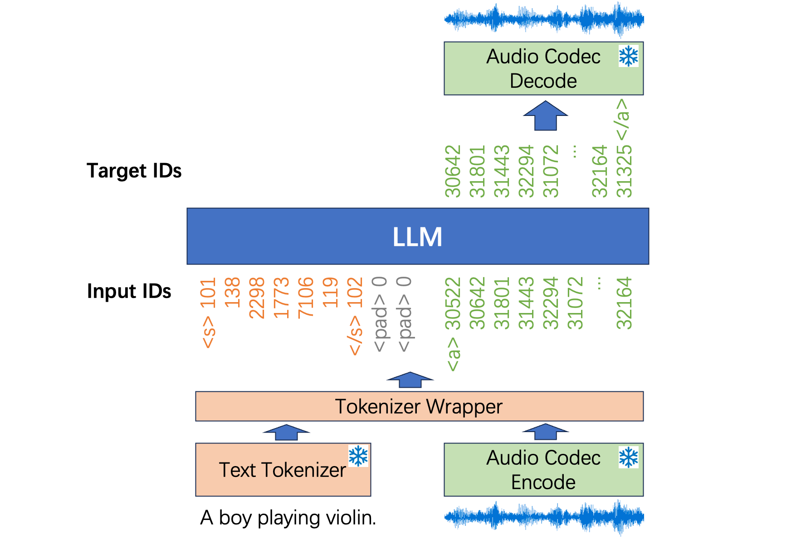
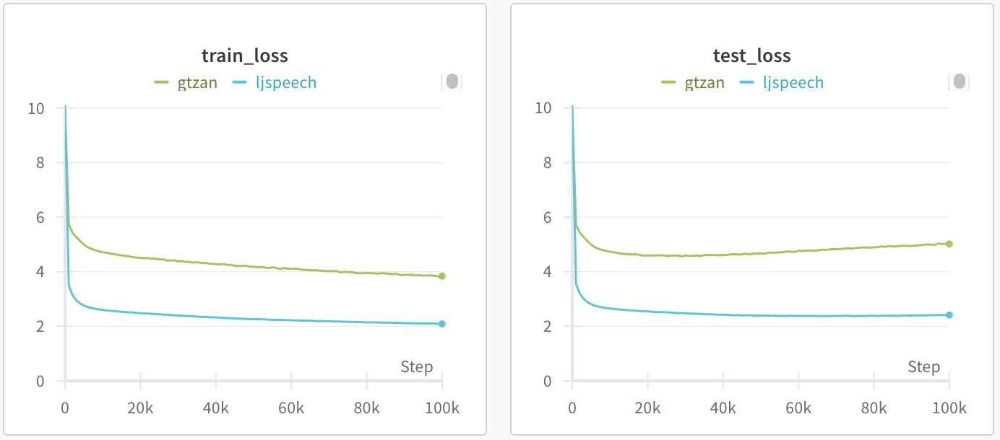

# Music Generation/TTS with Large Language Models

This repository contains a PyTorch implementation of music generation and text-to-speech (TTS) using LLaMA-based large language models (LLMs). During training, the system converts both text and audio into discrete tokens. the LLM system is trained to predict the next discrete ID. During sampling, the system generates discrete audio IDs in an autoregressive manner. The figure below illustrates the training process of the LLM. Users can train a music generation model in less than 10 hours using a single RTX 4090 GPU.



## 0. Install dependencies

```bash
# Clone the repo
git clone https://github.com/qiuqiangkong/music_llm
cd music_llm

# Install Python environment
conda create --name music_llm python=3.10

# Activate environment
conda activate music_llm

# Install Python packages dependencies
bash env.sh
```

## 0. Download datasets

To train TTS system, download LJSpeech dataset containing 24 hours of speech from a single speaker.

```bash
bash ./scripts/download_ljspeech.sh
```

To train music generation system, download GTZAN music dataset containing 8 hours of music with 10 genres.

```bash
bash ./scripts/download_gtzan.sh
```

## 1. Train

Train TTS model:

```python
CUDA_VISIBLE_DEVICES=0 python train.py --config="./configs/ljspeech.yaml"
```

Train music generation model:

```python
CUDA_VISIBLE_DEVICES=1 python train.py --config="./configs/gtzan.yaml"
```

The training takes around 10 hours to train for 100,000 steps on a single RTX4090 GPU.



### Train on Multiple GPUs.

We use Huggingface accelerate library to train the systems on multiple GPUs. train_accelerate.py just adds a few lines to train.py. Here is an example to run with 4 GPUs:

```python
CUDA_VISIBLE_DEVICES=0,1,2,3 accelerate launch --multi_gpu --num_processes 4 train_accelerate.py --config="./configs/ljspeech.yaml"
```

Then, the training can speed up by 4x times. The code can also train with multiple nodes such as 32 GPUs with 4 nodes.

## 2. Sample

Users can sample audio from text prompts using trained checkpoints:

```python
CUDA_VISIBLE_DEVICES=0 python sample.py \
	--config="./configs/ljspeech.yaml" \
	--ckpt_path="./checkpoints/train/ljspeech/step=100000.pth"
```

After training on 1 RTX4090 GPU for 100,000 stesp in 10 hours, the sampled audio sounds like:


| Task       | Training Dataset   | Text prompt                                                                                                   | Sample 1                                                                                      | Sample 2                                                                                                                                                                                                                                                                                                  |
|------------|-----------------|---------------------------------------------------------------------------------------------------------------|-----------------------------------------------------------------------------------------------|-----------------------------------------------------------------------------------------------|
| TTS        | LJSpeech (24 h) | A happy dog ran through the park, wagging its tail excitedly, greeting everyone with joy and boundless energy | <video src="https://github.com/user-attachments/assets/5d7421e9-9f64-48a1-92c5-6cfee04a6e8c"> | <video src="https://github.com/user-attachments/assets/3433b3b7-2b48-42a9-a138-3b8166591a85"> |
| Music Gen  | GTZAN (8 h)     | country                                                                                                       | <video src="https://github.com/user-attachments/assets/428dd426-787a-487b-9c32-197d61bfece3"> | <video src="https://github.com/user-attachments/assets/2655f774-7133-4a68-b3fc-11fd9786c79f"> |


## External links

The Llama model code is from: https://github.com/qiuqiangkong/mini_llm

## License

MIT
